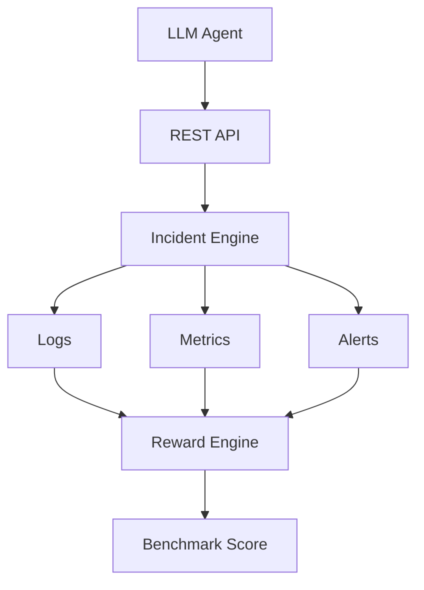

# 🚨 OpenEnv — AI Agent Benchmark for SRE Incident Response

[]()
[]()
[]()
[]()
[](https://www.python.org/downloads/)
[](https://github.com/openenv-project/openenv)
[](https://opensource.org/licenses/MIT)

> **OpenEnv is an AI-agent evaluation environment for benchmarking Site Reliability Engineering (SRE) incident response. It enables reproducible testing of autonomous agents using realistic production scenarios, deterministic scoring, and standardized APIs.**

## 💻 Requirements

- Python 3.10+
- Docker
- uv

## 📖 Overview

The **SRE Incident Triage Environment** simulates a high-pressure on-call scenario for a cloud e-commerce platform. AI agents are tasked with receiving production alerts, investigating logs and metrics, identifying root causes, and deploying safe mitigations—all while the system's health decays under simulated time pressure.

This project was built to provide a **highly realistic, operational task benchmark** for agentic workflows, mirroring real-world production incident response workflows used by large-scale cloud platforms.

### ✨ Key Features
- **Deterministic Grading**: Consistent evaluation criteria across multiple agent runs.
- **Dynamic System Health**: The environment actively decays system health with each step if critical issues are ignored.
- **Multi-step Reasoning**: Agents must perform diagnostic steps before executing mitigations.
- **Priority Handling**: Hard scenarios require the agent to prioritize immediate threats (e.g., DDoS) over secondary issues (e.g., Memory Leaks) to prevent cascading failures.

---

## 🏗️ Architecture



---

## 🎯 Incident Scenarios

The environment supports 3 difficulty levels, randomly assigned or manually forced via the `reset` options:

1. 🟢 **Easy (Task 1)**: *High CPU Alert*
   - **Scenario**: A single microservice is experiencing unexplained CPU spikes.
   - **Optimal Path**: `ANALYZE_LOGS payment` -> `ISOLATE_SERVICE payment-service`

2. 🟡 **Medium (Task 2)**: *Database Connection Pool Exhaustion*
   - **Scenario**: The application is hanging due to stale connections holding the DB hostage.
   - **Optimal Path**: `CHECK_METRICS db` -> `RESTART_POOL db`

3. 🔴 **Hard (Task 3)**: *Cascading Failure (DDoS + Memory Leak)*
   - **Scenario**: A simultaneous memory leak and suspicious traffic spike are occurring. 
   - **Optimal Path**: The agent *must* prioritize blocking the traffic (`BLOCK_IP_RANGE suspicious`) before analyzing the memory (`ANALYZE_LOGS memory`). Doing the reverse results in immediate system failure.

---

## 📊 Benchmark Results

**Example Benchmark Output (Illustrative)**

| Agent | Scenario | Score |
| :--- | :--- | :--- |
| Baseline | CPU Spike | 78 |
| GPT-4 | CPU Spike | 94 |

---

## 📸 Screenshots

### Incident Resolution Flow (Demo)


### Swagger UI


### API Responses


### Terminal Execution


---

## 🛠️ API & Agent Interfaces

### Actions
The agent interacts with the environment by executing specific command strings:
*   `ANALYZE_LOGS [type]`
*   `CHECK_METRICS [component]`
*   `ISOLATE_SERVICE [name]`
*   `RESTART_POOL [db]`
*   `BLOCK_IP_RANGE [range]`
*   `SUBMIT_REPORT`

### Observations
The environment returns detailed JSON observations to the agent:
*   `output`: The terminal output/result of the executed command.
*   `system_health`: Current system health score (0-100%).
*   `time_used`: Number of steps taken (ticks).
*   `alert_summary`: High-level summary of the active alert from PagerDuty.

---

## 🚀 Quick Start (Local Setup)

To run the OpenEnv environment locally for agent testing:

1. **Install dependencies:**
   ```bash
   uv sync
   ```

2. **Start the FastAPI server:**
   ```bash
   uv run uvicorn server.app:app --port 8000
   ```
   *Note: The server will host the OpenEnv HTTP interface. A visual API dashboard (Swagger) will be available at `http://127.0.0.1:8000/docs`.*

3. **Run the baseline agent test:**
   In a separate terminal window, run the inference baseline to verify the environment:
   ```bash
   uv run inference.py
   ```

### Example Agent Run

```bash
$ uv run inference.py

Scenario: CPU Spike
Action: ANALYZE_LOGS payment
✓ Success

Action: ISOLATE_SERVICE payment-service
✓ Success

Benchmark Score: 94
```

---

## 🛠️ Engineering Decisions

**Why FastAPI?**
- Async support
- Lightweight
- Easy OpenAPI integration

**Why Docker?**
- Reproducibility
- Portable evaluation

**Why deterministic grading?**
- Fair benchmarking
- Reproducible experiments

---

## 📁 Project Structure

```text
OpenEnv/
├── server/
├── assets/
├── inference.py
├── models.py
├── Dockerfile
├── pyproject.toml
└── README.md
```

---

## 🗺️ Roadmap

- [x] REST API
- [x] Benchmark Engine
- [x] Docker Support
- [ ] Kubernetes deployment
- [ ] Multi-agent evaluation
- [ ] LangGraph integration
- [ ] Agent leaderboard

---

**Interested in contributing?** See [CONTRIBUTING.md](CONTRIBUTING.md).

---

### 🤝 Open Source Contribution — OpenEnv

**Role:** Contributor

**Contribution:** Added SRE scenario specifications, deterministic grading scripts, interactive Swagger UI documentation, and benchmark execution logs.

---

[LICENSE](LICENSE) | *Built for the Open Source AI Agent Hackathon.*
